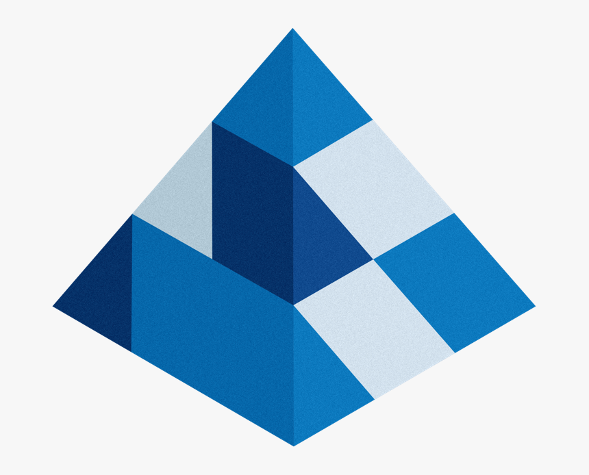
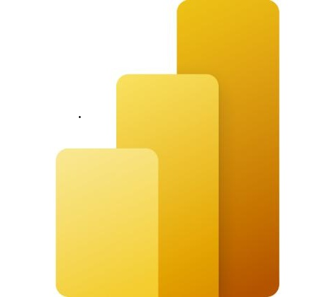
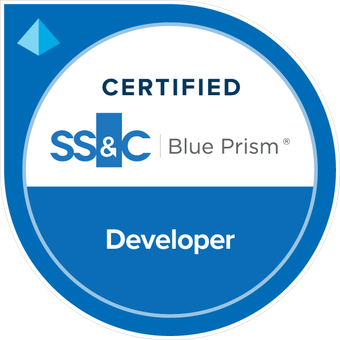

  <!-- Quando criar o portfólio, troque o link abaixo -->
  

 

<table>
<tr>

<td width="55%" valign="top">

### Python Developer & RPA Engineer • Intelligent Automation

`Python Developer` | `RPA Engineer` | `Hyperautomation` | `CoE` | `DevOps` | `Intelligent Automation`

Desenvolvedor focado em **automação de processos (RPA)** e **hiperautomação**, atuando em projetos ponta a ponta — da concepção (PDD/SDD) ao desenvolvimento, administração e operação em **Control Room**.

 

**RPA & Hyperautomation**
- **Blue Prism** como Desenvolvedor, Administrador, Analista e Control Room
- Desenvolvimento RPA em **SAP ERP** e automação em sistemas **Oracle**
- **BotCity** e automação de processos com Python
- Arquitetura de software com foco em RPA
- Documentação de processos: **PDD** e **SDD**

 

**Python & Dados**
- Web scraping, **Selenium**, **Playwright**, **Pywinauto**, **PyAutoGUI** e interfaces gráficas
- **SQLAlchemy**, **Alembic**, **Pydantic**, **Pandas**, **Openpyxl**
- **ETL**, análise de dados e visualização com **Power BI**
- Tratamento e processamento de dados em **PDF** e **Excel**
- Bancos de dados: **PostgreSQL** e **SQL Server**

 

**DevOps & IA**
- Containerização com **Docker** e versionamento com **Git** / **GitHub**
- Orquestração de workflows e pipelines com **Apache Airflow**
- Observabilidade e dashboards com **Grafana** e **Elasticsearch**
- Aplicação de **IA / LLMs** em soluções de automação inteligente
- Construção de **pipelines de dados para RAG** (Retrieval-Augmented Generation)
- Criação e uso de **Agentes de IA com Claude** (Anthropic) — desenvolvendo **Skills**, **Agents** e **Hooks**

 

**Formação**
- Bacharel em Sistemas de Informação

 
</td>

<td width="45%" valign="top" align="center">

<!-- Adicione um banner pessoal aqui depois, se quiser (igual ao do Thiago) -->

  
  
  

  

 

</td>
</tr>
</table>

  

 

## Tech Stack

&nbsp;

&nbsp;

 

  

 

## Certificações

<table>
<tr>

<td width="25%" align="center">

  
Desenvolvedor Blue Prism — AD01
</td>

<td width="25%" align="center">

  
Python Impressionador — Hashtag Treinamento
</td>

<td width="25%" align="center">

  
Automações Inteligentes com Python e BotCity
</td>

<td width="25%" align="center">

  
Bacharel em Sistemas de Informação
</td>

</tr>
</table>

 

  

 

<!-- Snake animation: requer o workflow .github/workflows/snake.yml (já incluído) -->
<picture>
  <source media="(prefers-color-scheme: dark)"
    srcset="https://raw.githubusercontent.com/joaopaulobarbosalima/joaopaulobarbosalima/output/github-contribution-grid-snake-dark.svg" />
  <source media="(prefers-color-scheme: light)"
    srcset="https://raw.githubusercontent.com/joaopaulobarbosalima/joaopaulobarbosalima/output/github-contribution-grid-snake.svg" />
  
</picture>

 

  

